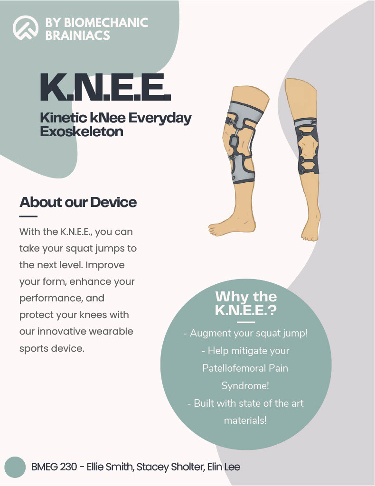
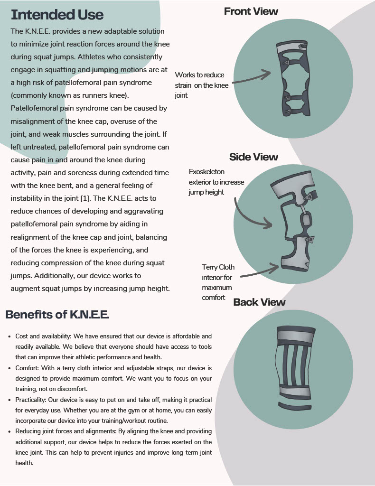
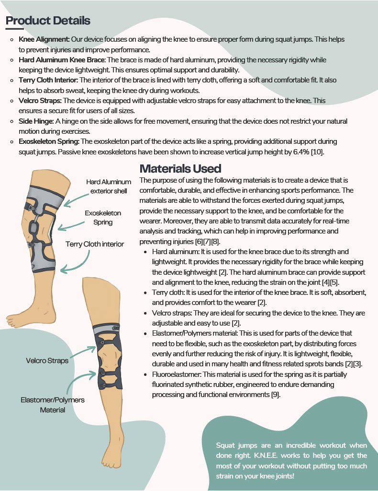
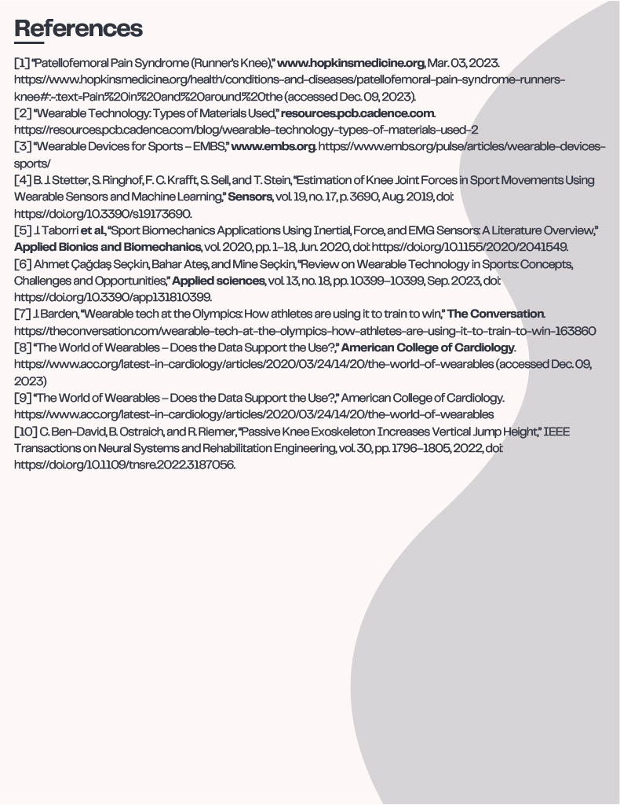

This is my biomechanics 1 course project during my 2nd year. The purpose of the project is to enhance athlete performance, leading to the development of a biomechanical device that addresses Patellofemoral Pain Syndrome by balancing knee joint forces, using OpenPose and MATLAB for data analysis and applying comprehensive engineering design processes for prototype development.
 

You can read about the entire research, data analysis, and design processes in the included final report [here](./BMEG%20230%20Final%20Report.pdf)
 

### Here are some cool sections of the report:

  

  

### This is the mock commercial brochure for our device!

  

  

  

  

